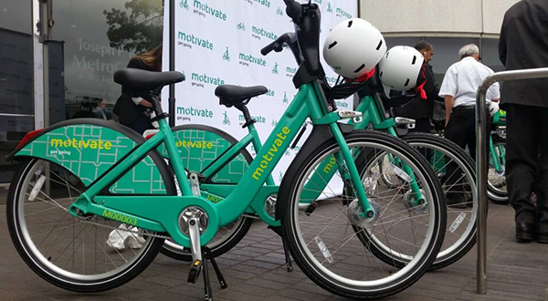
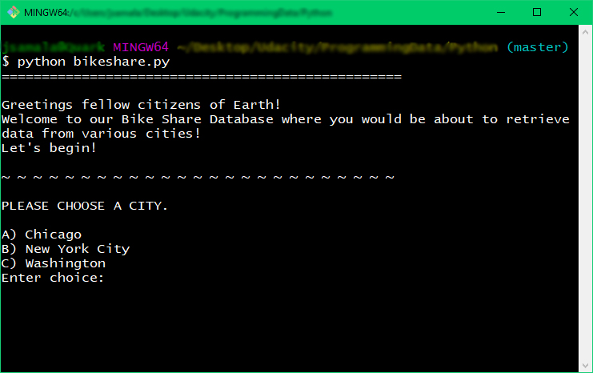
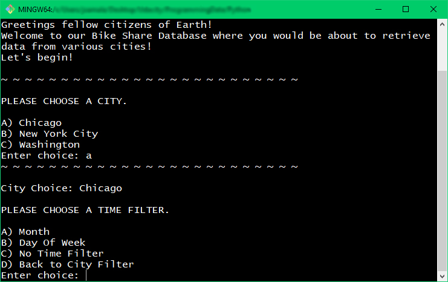
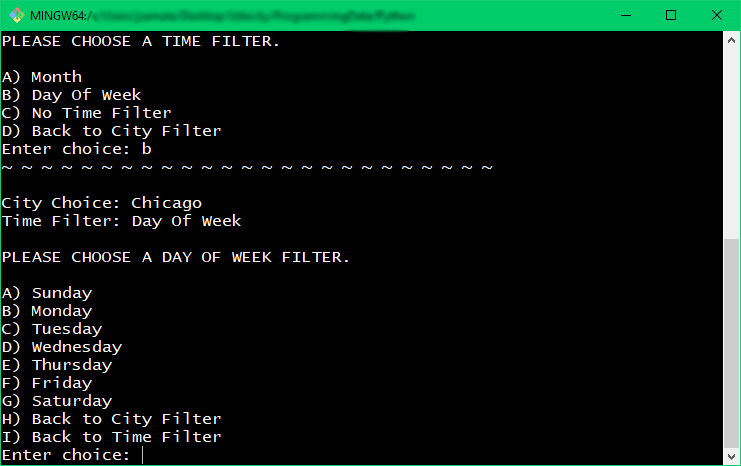
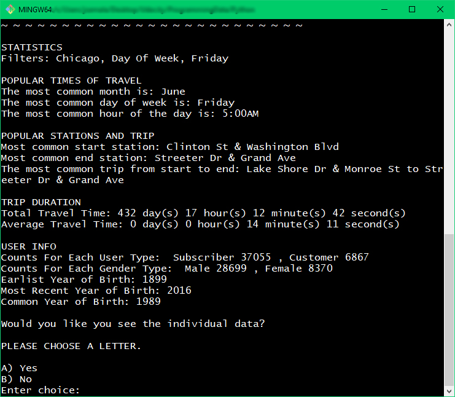
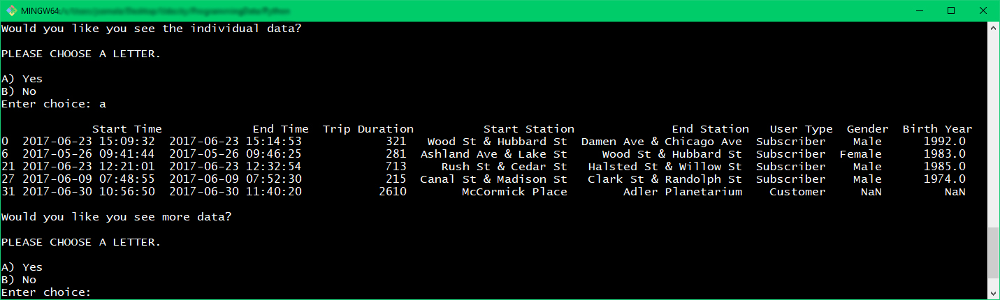
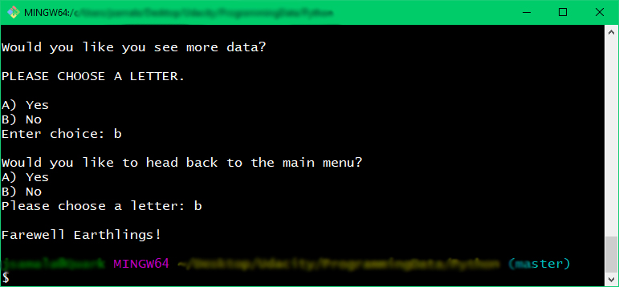

# OVERVIEW

This is Udacity's second project under Programming for Data Science Nanodegree Program. (Completed on October 4, 2018)

This project focused on gaining on hand experience with the basics of Python. As part of this project, we used Python to explore the data related to bike share systems from three major cities in the United States: Chicago, New York City, and Washington. Our task was to write code that was able to import data and answer questions regarding computing descriptive statistics. We were to write a script that would take the raw input of the users and provide them an interactive experience in the terminal to present these statistics.

Recently, bicycle-sharing systems have grown in popularity. Bicycle-sharing systems allow customers to rent bikes for a short amount of time by simply borrowing a bike from point A and returning the bike to point B.

***

Motivate is one of the popular company that provides a bicycle-sharing system. 

No copyright infringement is intended.

<a href='https://thehustle.co/lyft-motivate-bikes/'> SOURCE </a>

***

# ABOUT THE DATASET

We will be using the dataset provide by Motivate.

**FEATURES:**
+ Start Time (e.g., 2017-01-01 00:07:57)
+ End Time (e.g., 2017-01-01 00:20:53)
+ Trip Duration (in seconds - e.g., 776)
+ Start Station (e.g., Broadway & Barry Ave)
+ End Station (e.g., Sedgwick St & North Ave)
+ User Type (Subscriber or Customer)
+ The Chicago and New York City files also have the following two columns:
+ Gender
+ Birth Year

***

# STATISTICS TO BE COMPUTED

1. Popular times of travel (i.e., occurs most often in the start time)
    + most common month 
    + most common day of week 
    + most common hour of day

2. Popular stations and trip
    + most common start station 
    + most common end station 
    + most common trip from start to end (i.e., most frequent combination of start station and end station)

3. Trip duration
    + total travel time 
    + average travel time

4. User info
    + counts of each user type 
    + counts of each gender (only available for NYC and Chicago) 
    + earliest, most recent, most common year of birth (only available for NYC and Chicago)
    

***

# PROJECT RESULTS

When we opened up our file, we are first welcomed by HAL who gives us the option to choose a city from the list.

Here, we have informed HAL that we wish to see information from Chicago. Next, we are given a time filter choice. Notice HAL also gives us an option to go back to the city filter list just in case we have changed our minds.

I have chosen the Day of Week filter and now HAL has provided us a list of days of a week.

HAL has all the information he needs. We are now provided statistics under the filters we have chosen.
We are then given the option to see the actual filtered data.

HAL has provided us the first 5 rows of our filtered data.

At the very end of program, we are given a farewell greeting. :)

